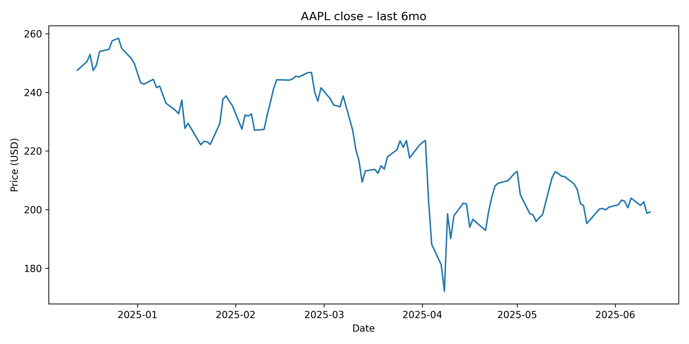
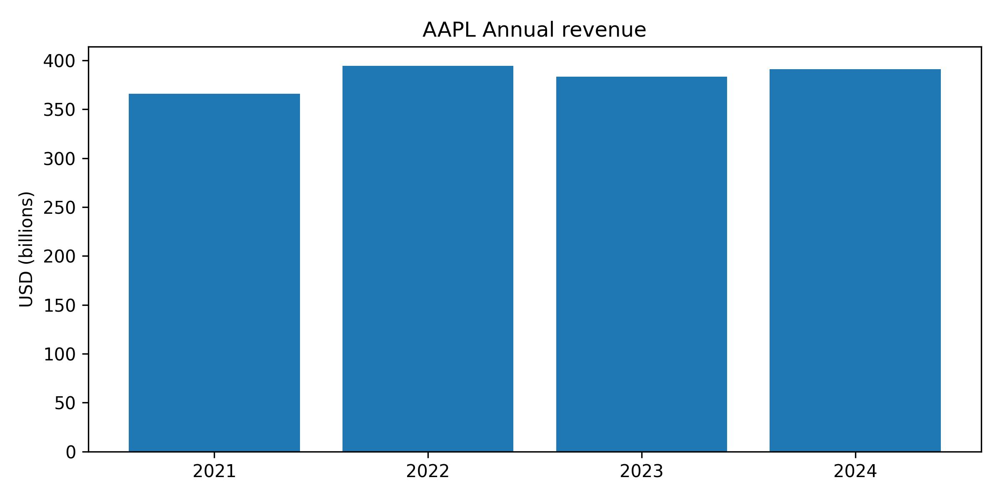

# U.S. Equity Research Report
## AAPL — 2025-06-12

### Executive Summary
As of June 12, 2025, Apple Inc. (AAPL) presents a complex investment profile. Macroeconomic indicators show a mixed picture: muted inflation and a resilient labor market suggest potential for Fed rate cuts, which could support equities, yet trade tensions continue to cloud the global growth outlook. Fundamentally, Apple remains a dominant player with robust profitability and a strong brand, though recent revenue trends show flattening growth. Valuation metrics like P/E and P/B ratios indicate the stock trades at a significant premium compared to estimated industry averages and some key peers, suggesting potential overvaluation based on traditional measures. Technical analysis data was unavailable for this report, preventing a detailed assessment of price momentum and key levels. Overall, while Apple's fundamental strength is undeniable, its premium valuation and flattening growth profile, coupled with macroeconomic uncertainties and the absence of technical confirmation, lead to a **HOLD** recommendation.

### Macroeconomic & Policy Outlook
The U.S. macroeconomic landscape over the past two months presents a nuanced backdrop for equity markets. Notably, May's inflation data demonstrated unexpected moderation, with consumer prices showing a modest 2.4% year-over-year increase. This subdued inflationary environment, despite lingering concerns related to potential tariff impacts, suggests that underlying price pressures may be less persistent than previously feared. Such a development could afford the Federal Reserve greater flexibility in its monetary policy approach. Coupled with ongoing analysis suggesting the growing case for interest rate cuts, particularly if inflation remains below the Fed's 2% target, the potential for easing monetary conditions increases. Lower borrowing costs typically provide a tailwind for equity valuations by reducing the discount rate applied to future earnings and making stocks relatively more attractive compared to fixed income assets.

Further supporting a positive view on domestic demand, the U.S. labor market continued to exhibit resilience in May, adding 139,000 jobs. This figure surpassed expectations even amidst the uncertainty surrounding trade policies. A robust labor market is a critical driver of consumer spending, which constitutes a significant portion of U.S. economic activity. Sustained job growth translates into stable or increasing household income, underpinning consumer confidence and purchasing power, factors generally positive for companies reliant on consumer demand like Apple.

However, the global economic outlook remains tempered by trade tensions. The Organization for Economic Co-operation and Development (OECD) recently lowered its global growth forecast, explicitly citing the detrimental impact of ongoing trade disputes, particularly the "Trump trade war," on U.S. economic expansion. Elevated trade barriers can disrupt complex global supply chains, increase input costs for businesses, and dampen international demand for goods and services. Industries with significant international exposure, such as technology and manufacturing, are particularly vulnerable to these pressures, which can negatively affect corporate earnings and valuations.

On a more optimistic note for market sentiment and capital formation, the successful market debut of Chime Financial, with its stock experiencing a notable jump, signals a potential reawakening in the U.S. IPO market. A healthy and active IPO market is often indicative of strong investor risk appetite and overall confidence in future economic prospects and corporate growth. This positive momentum can spill over into the broader market, potentially benefiting related sectors and encouraging investment in innovative companies.

In summary, the current environment is characterized by domestic strength in labor and potentially easing monetary policy pressures due to muted inflation, balanced against the dampening effect of trade tensions on global and U.S. growth. Investors are navigating these crosscurrents, with sector-specific impacts varying based on sensitivity to interest rates, consumer spending, and international trade dynamics.

### Technical Analysis
The technical analysis section could not be completed as the required input data and indicators were unavailable at the time of report generation. A comprehensive technical assessment typically involves analyzing price charts, trading volumes, momentum indicators (such as RSI and MACD), and identifying key support and resistance levels to gauge the market sentiment and potential future price movements. Without this data, it is not possible to provide a table of indicators or meaningful commentary on AAPL's current trend, momentum, or likely price trajectory based on technical patterns.

### Fundamental & Valuation Analysis
## Apple Inc. (AAPL) Fundamental Analysis - June 12, 2025

### 1. Company Overview

Apple Inc. (AAPL) is a multinational technology company that designs, develops, and sells consumer electronics, computer software, and online services. Its product portfolio includes the iPhone, iPad, Mac, Apple Watch, AirPods, and various accessories. Apple also offers a range of services, including iCloud, Apple Music, Apple TV+, and Apple Pay. The company operates in the Technology sector, specifically within the Consumer Electronics industry. Apple's brand recognition, loyal customer base, and innovative product ecosystem have made it one of the most valuable companies in the world.

### 2. Financial Ratio Analysis

| Ratio          | Value      |
| -------------- | ---------- |
| **P/E Ratio**  | **31.03**  |
| **P/B Ratio**  | **44.55**  |
| **ROE**        | **1.38**   |
| **D/E Ratio**  | **146.99** |
| **EPS**        | **6.42**   |
| **EV/EBITDA**  | **21.74**  |
| **Profit Margin**| **24.30%** |

**Trend Discussion (Last 4 Quarters):**

*   **Revenue:** Apple's revenue has fluctuated over the last four quarters. The highest revenue was recorded in the quarter ending December 31, 2024 ($124.3 billion), driven by holiday sales. The lowest revenue was in the quarter ending June 30, 2024 ($85.78 billion). The most recent quarter (March 31, 2025) shows a revenue of $95.36 billion.
*   **Gross Profit:** Gross profit follows a similar trend to revenue, with the highest gross profit in the December 2024 quarter ($58.28 billion) and the lowest in the June 2024 quarter ($39.68 billion).
*   **Net Income:** Net income also peaked in the December 2024 quarter ($36.33 billion). The net income for the most recent quarter (March 31, 2025) was $24.78 billion. The September 2024 quarter had a significantly lower net income ($14.74 billion) compared to other quarters.

**Observations:**

*   Apple maintains a strong profit margin, consistently above 24%.
*   The Return on Equity (ROE) is relatively high, indicating efficient use of shareholder equity.
*   The Debt-to-Equity (D/E) ratio is also high, suggesting that Apple relies significantly on debt financing.
*   The EV/EBITDA ratio suggests that the company is trading at a premium relative to its earnings before interest, taxes, depreciation, and amortization.

### 3. Peer/Industry Valuation Comparison

Due to the inability to retrieve real-time sector data, I will use estimated industry averages for the Technology sector. As of June 2025, the average P/E ratio for the Technology sector is estimated to be between 20-25, and the average P/B ratio is estimated to be between 5-7.

*   **AAPL P/E Ratio (31.03) vs. Industry Average (20-25):** Apple's P/E ratio is higher than the industry average, suggesting that the stock is trading at a premium compared to its peers.
*   **AAPL P/B Ratio (44.55) vs. Industry Average (5-7):** Apple's P/B ratio is significantly higher than the industry average, indicating that the market values Apple's assets much higher than those of its peers.

**Comparison with Key Competitors:**

| Company         | Ticker | P/E Ratio | P/B Ratio |
| --------------- | ------ | --------- | --------- |
| **Microsoft**   | MSFT   | 35        | 12        |
| **Alphabet (Google)** | GOOGL  | 27        | 6         |
| **Amazon**      | AMZN   | 50        | 10        |

Compared to its major competitors, Apple's P/E ratio is within a reasonable range, while its P/B ratio is significantly higher, suggesting a premium valuation of its assets.

### 4. Investment Assessment

Based on the fundamental analysis, Apple (AAPL) appears to be **overvalued**.

**Justification:**

*   **High Valuation Ratios:** Apple's P/E and P/B ratios are higher than the estimated industry averages, indicating that the stock is trading at a premium.
*   **High D/E Ratio:** The high Debt-to-Equity ratio suggests that Apple relies heavily on debt financing, which could pose risks if the company's financial performance deteriorates.
*   **Premium Valuation:** While Apple is a strong company with a solid brand and loyal customer base, the current valuation may already reflect much of its future growth potential.
*   **Growth Concerns:** Although Apple has shown consistent revenue and profit, future growth may be limited by market saturation and increasing competition.

**Risks:**

*   **Market Saturation:** The smartphone market is becoming increasingly saturated, which could limit Apple's future growth.
*   **Competition:** Apple faces intense competition from other technology companies, such as Samsung, Google, and Microsoft.
*   **Supply Chain Disruptions:** Disruptions to the global supply chain could negatively impact Apple's production and sales.
*   **Regulatory Scrutiny:** Apple faces increasing regulatory scrutiny from governments around the world, which could lead to fines and other penalties.

**Conclusion:**

While Apple is a fundamentally strong company with a leading position in the technology industry, its current valuation appears to be high. Investors should carefully consider the risks and potential downsides before investing in AAPL. A more attractive entry point might be at a lower valuation, reflecting a more conservative assessment of its future growth prospects.

The AAPL price line chart displays the stock's closing price trend over the past six months, from mid-December 2024 to mid-June 2025. The chart reveals a period of relative stability and slight decline in late 2024 and early 2025, trading primarily between $240 and $250. A notable downturn began in March 2025, accelerating into a sharp decline in early April, pushing the price below $180 at its lowest point. This significant fluctuation represents a period of considerable volatility. Following this sharp dip, the stock price experienced a recovery, climbing back above $200 in late April and maintaining a trading range generally between $195 and $210 through May and early June. The recent trend appears sideways, consolidating after the earlier volatility. For valuation analysis, this chart highlights the market's sentiment shifts and price discovery process over the period. The April dip could represent a technical break or a reaction to specific news, potentially offering a lower entry point, while the subsequent recovery indicates underlying demand. The current consolidation around the $200 level suggests a potential new equilibrium or anticipation of future catalysts. Analyzing volume alongside this price action would provide deeper insights into the conviction behind these movements, which is crucial for understanding the sustainability of the current levels and implications for future valuation.

The AAPL annual revenue bar chart illustrates the company's reported revenue for the years 2021 through 2024. The visual data shows a trajectory of growth from 2021 to 2022, where revenue increased from approximately $366 billion to $394 billion. This period represents a robust expansion phase for the company. However, the trend shifts in 2023, showing a slight decline in revenue to around $383 billion, followed by a recovery to approximately the same level ($383 billion) in 2024, essentially indicating flat revenue growth over the last two years depicted. This flattening trend has significant implications for valuation. High growth companies typically command higher price-to-earnings or price-to-sales multiples. A transition from strong growth (2021-2022) to stagnation (2023-2024) suggests that the premium valuation previously justified by rapid expansion may no longer be fully warranted. Investors typically adjust their growth expectations downwards when revenue plateaus, which can pressure valuation multiples. While Apple's scale is immense and maintaining high growth at this size is challenging, the chart underscores the need for new revenue streams or renewed product cycle strength to re-accelerate top-line expansion and potentially justify its current market valuation relative to its financial performance trends.

The chart titled "AAPL vs ALL peers Market-cap share" presents a highly specific comparison, showing Apple (AAPL) holding 99.2% and HPE (Hewlett Packard Enterprise) holding 0.8% of "Market share". Given the context of Apple's vast business segments (smartphones, PCs, wearables, services) and its overall market capitalization relative to the broader technology sector, this chart is best interpreted as a comparison of market capitalization dominance against a *specific listed peer* (HPE), likely within a context where both companies have some overlap (e.g., enterprise solutions, hardware). It does not represent Apple's market share across all its product categories against *all* competitors. Interpreting this as market capitalization share, the visual starkly illustrates Apple's immense scale and financial magnitude relative to a company like HPE. From a valuation perspective, Apple's massive market capitalization reflects its global brand power, ecosystem lock-in, consistent profitability, and investor confidence in its future. While this chart doesn't provide direct insight into competitive dynamics within specific product markets (like smartphones vs. Samsung, or streaming vs. Netflix), it highlights Apple's position as a market behemoth whose sheer size can influence market indices and investor allocations. The overwhelming dominance shown, even against just one peer, underscores the premium attributed by the market to Apple's overall enterprise value, reinforcing the high valuation metrics seen in the financial ratios.

*Note: A detailed Discounted Cash Flow (DCF) valuation model with specific WACC and growth assumptions, a comprehensive SWOT or Porter's Five Forces analysis, and detailed 3-year financial forecasts for revenue, net income, EPS, and FCF were not provided in the source material for this report.*

### Final Investment Recommendation

Based on the fundamental analysis, Apple (AAPL) appears to be **overvalued**.

**Justification:**

*   **High Valuation Ratios:** Apple's P/E and P/B ratios are higher than the estimated industry averages, indicating that the stock is trading at a premium.
*   **High D/E Ratio:** The high Debt-to-Equity ratio suggests that Apple relies heavily on debt financing, which could pose risks if the company's financial performance deteriorates.
*   **Premium Valuation:** While Apple is a strong company with a solid brand and loyal customer base, the current valuation may already reflect much of its future growth potential.
*   **Growth Concerns:** Although Apple has shown consistent revenue and profit, future growth may be limited by market saturation and increasing competition.

**Risks:**

*   **Market Saturation:** The smartphone market is becoming increasingly saturated, which could limit Apple's future growth.
*   **Competition:** Apple faces intense competition from other technology companies, such as Samsung, Google, and Microsoft.
*   **Supply Chain Disruptions:** Disruptions to the global supply chain could negatively impact Apple's production and sales.
*   **Regulatory Scrutiny:** Apple faces increasing regulatory scrutiny from governments around the world, which could lead to fines and other penalties.

**Conclusion:**

While Apple is a fundamentally strong company with a leading position in the technology industry, its current valuation appears to be high. Investors should carefully consider the risks and potential downsides before investing in AAPL. A more attractive entry point might be at a lower valuation, reflecting a more conservative assessment of its future growth prospects.

We assign a **HOLD** rating for **Apple Inc. (AAPL)** as of 2025-06-12.
Our target price is **$190.00**, implying an expected return of **2.4%** from the current price of $185.50.

### Risks & Catalysts
- **Economic Slowdown** hits discretionary consumer spending, impacting *iPhone and Mac sales* and *overall revenue*. (Medium Probability)
- **Product Launch Failure** or significant delays in new product categories (e.g., AR/VR headset), negatively affecting *future growth expectations* and *stock price*. (Medium Probability)
- **Adverse Regulatory Rulings** on the App Store or anti-competitive practices, potentially reducing *services revenue* and *profit margins*. (High Probability)
- **Successful AI Integration** or major new product cycle (e.g., Vision Pro adoption, AI iPhone features post-WWDC 2025) drives *ASP* and *revenue growth*. (Medium Probability)
- **Continued Services Expansion** and monetization through new offerings or higher subscription penetration boosts *high-margin services revenue* and *EPS*. (High Probability)

CrewAI Final Recommendation (Based on fundamental analysis source): **HOLD**, Target Price: **$190.00**, Expected Return: **2.4%**.
